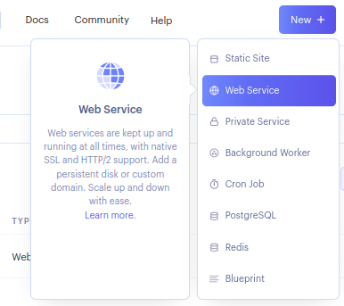
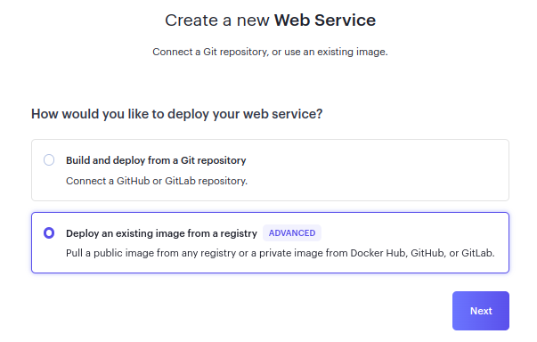
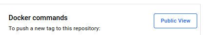
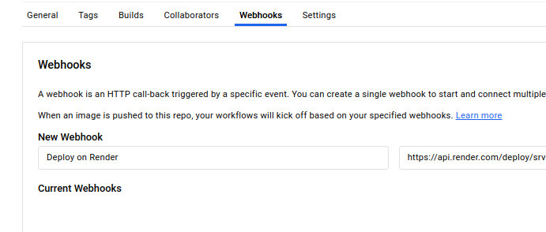

# Création d'un pipeline CI/CD pour un projet Django

> [!WARNING]
> Attention, ce tutoriel est en cours de rédaction. Le projet Django tel qu'il
> est ici présent n'est pas configuré pour être en production.

## Sommaire

- [Création d'un pipeline CI/CD pour un projet Django](#cration-dun-pipeline-cicd-pour-un-projet-django)
    - [Objectif](#objectif)
    - [Prérequis](#prrequis)
    - [Dépôt Git](#dpt-git)
    - [Projet Django](#projet-django)
    - [Docker](#docker)
    - [Render](#render)
    - [Github Actions](#github-actions)

## Objectif

Mettre en place un pipeline CI/CD pour un projet Django. Le pipeline doit
automatiser les tâches suivantes :
- Construire l'image Docker
- Pousser l'image Docker sur Docker Hub
- Déployer l'image Docker sur Render
- Mettre à jour l'image Docker sur Render à chaque push sur la branche principale

## Prérequis

Avoir les bases suivantes :
- Python
- Django
- Docker
- Git & Github
- YML

Outils :
- Django
- Gunicorn
- Docker
- Docker Hub
- Git
- Github
- Github Actions
- Render

## Dépôt Git

Créer un dépôt Git sur Github.

Cloner le dépôt en local.

```bash
git clone <url>
```

Créer un fichier `.gitignore` à la racine du projet.

```bash
touch .gitignore
```

Ajouter les fichiers et dossiers à ignorer dans le fichier `.gitignore`.

```bash
# .gitignore
__pycache__/
*.py[cod]
*.sqlite3
```

## Projet Django

Créer un environnement virtuel. Il peut être plus pratique d'avoir tous les environnements virtuels dans un même dossier. 

```bash
python -m venv ~/.virtualenvs/django-cicd
source ~/.virtualenvs/django-cicd/bin/activate
```

Installer Django et les dépendances.

```bash
pip install -U pip django gunicorn
```

Créer un projet Django ainsi qu'une application. 

```bash
mkdir django-cicd && cd django-cicd
django-admin startproject core .
python manage.py startapp pages
```

Ajouter l'application `pages` dans les `INSTALLED_APPS` du fichier `settings.py`.

```python
# core/settings.py
INSTALLED_APPS = [
    ...
    'pages',
]
```
 
```python
# pages/views.py
from django.shortcuts import render

def homepage(request):
    return render(request, "pages/homepage.html")
```

Ajouter un template HTML django-cicd/pages/templates/pages/homepage.html
```html
<!-- pages/templates/pages/homepage.html -->
<h1>Django app deployed !</h1>
```

Configurer les routes dans le fichier `urls.py`.

```python
# core/urls.py
from django.contrib import admin
from django.urls import path

from pages.views import homepage


urlpatterns = [
    path("admin/", admin.site.urls),
    path("", homepage),
]
```

Tester le projet :

```bash
python manage.py runserver
```

## Docker

Installer Docker en local. Soit Docker Desktop pour Windows et Mac, soit Docker Engine pour Linux.

Je suis sous Linux, j'ai suivi les instructions suivantes : https://github.com/docker/buildx?tab=readme-ov-file#linux-packages

Créer un Dockerfile à la racine du projet :

```Dockerfile
# Pull an official python image
FROM python:3.13-rc-slim

# Set the working directory in the container
WORKDIR /usr/src/app

# Set environment variables

# Prevents Python from writing pyc files to disc
ENV PYTHONDONTWRITEBYTECODE 1
# Prevents Python from buffering stdout and stderr
ENV PYTHONUNBUFFERED 1

# Install dependencies
COPY requirements.txt .

# Upgrade pip and prevents keeping the cache
RUN pip install -U pip && pip install --no-cache-dir -r requirements.txt

# Copy the project files into the working directory
COPY . .

# Open the port 8000
EXPOSE 8000

# Run the application with Gunicorn, a WSGI HTTP server for Python
CMD ["gunicorn", "--bind", "0.0.0.0:8000", "core.wsgi:application"]
```

Créer un compte sur Docker Hub si ce n'est déjà fait.

Avec les commandes suivantes, on peut construire l'image Docker et la pousser sur Docker Hub.

Tu peux utiliser "latest" comme tag pour l'image Docker. C'est le tag par défaut.

```bash
docker build -t <username>/<repository>:<tag> .
docker login
docker push <username>/<repository>:<tag>
```

Utiliser le nom d'utilisateur choisi sur Docker Hub pour `<username>`, le nom du dépôt pour `<repository>` et le tag de l'image (latest) pour `<tag>`.

Si tu as omis de tagger l'image, tu peux le faire avec la commande suivante :

```bash
docker tag <image_id> <username>/<repository>:<tag>
```

## Render

Créer un compte sur Render si ce n'est déjà fait.

A partir du dashboard, créer un nouveau service web. 



Choisir de déployer à partir d'une image
provenant d'un registre.




Entrer l'URL de l'image Docker sur Docker Hub. 

Sur Docker Hub, utiliser le lien public de l'image Docker sur Docker Hub.



Cliquer sur "Next".

Choisir un nom de service.

Choisir la région la plus proche.

Choisir le plan gratuit pour les *hobby projects*.

Cliquer sur "Create Web Service".

Cliquer sur *Settings* pour aller dans les paramètres du service.

Copier le webhook fourni par Render afin de déclencher le déploiement à chaque
"push" sur Docker Hub. Il commence par `https://api.render.com/deploy/...`.

Sur Docker Hub, dans la section **Webhooks**, créer un nouveau webhook en lui
donnant un nom et en entrant l'URL fourni par Render.



Dans les paramètres de votre projet Django, ajouter à la liste ALLOWED_HOSTS de
votre fichier settings.py l'URL de votre service Render.

```python
# core/settings.py
ALLOWED_HOSTS = [
    ...
    "<subdomain>.onrender.com",
]
```

## Github Actions

Créer un fichier `.github/workflows/deploy.yml` à la racine du projet.

```bash
mkdir -p .github/workflows
touch .github/workflows/deploy.yml
```

```yml
name: Deploy a Django app from Docker Hub to Render

on: 
  push:
    branches:
      - main

jobs:
  build:
    runs-on: ubuntu-latest
    steps:
      - uses: actions/checkout@v4
      - uses: actions/setup-python@v4
        with:
          python-version: "3.11.6"
      - run: |
          python -m pip install --upgrade pip
          pip install -r requirements.txt
  deploy:
    runs-on: ubuntu-latest
    needs: build
    steps:
      - 
        name: Login to Docker Hub
        uses: docker/login-action@v3
        with:
          username: ${{ secrets.DOCKERHUB_USERNAME }}
          password: ${{ secrets.DOCKERHUB_TOKEN }}
      -
        name: Build and push Docker image
        uses: docker/build-push-action@v5
        with:
          push: true
          tags: ${{ secrets.DOCKERHUB_USERNAME }}/django-cicd:latest
```

Une fois toutes les modifications effectués au dépôt local, les ajouter et les pousser sur Github.

```bash
git add .
git commit -m "Initial commit"
git push origin main
```

Aller des les paramètres du dépôt sur Github, puis dans *Secrets and
variables*, puis *Actions*, et ajouter les secrets suivants en cliquant sur
*New repository secret* ::

- `DOCKERHUB_USERNAME` : le nom d'utilisateur sur Docker Hub
- `DOCKERHUB_TOKEN` : le token d'accès sur Docker Hub

Pour créer un token d'accès sur Docker Hub, aller dans les paramètres du compte
en cliquant sur l'avatar en haut à droite, puis *My Account*, puis *Security*.

Cliquer sur *New Access Token* et donner un nom au token. 

Sélectionner les permissions *Read & Write*.

Copier le token et créer un nouveau secret sur Github avec pour nom
`DOCKERHUB_TOKEN`, le même quand que celui utilisé dans le fichier de workflow.

[Github repository secrets](docs/github_repo_secrets.png)

Pour voir le pipeline en action, aller dans l'onglet *Actions* du dépôt sur Github.
